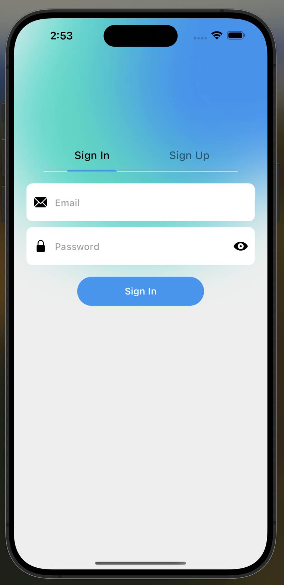

# Flutter Pizza App

A Flutter application that mimics a typical pizza delivery app, with user authentication handled through Firebase. This app allows users to:

* **Create an account** and sign in using Firebase Authentication.
* **Browse through a menu** of delicious pizzas with various toppings.


## Table of Contents

1. [Getting Started](#getting-started)
    - [Prerequisites](#prerequisites)
    - [Installation](#installation)
2. [Usage](#usage)
3. [Contributing](#contributing)
4. [Contact](#contact)
5. [Credits](#credits)


## Features

* User interface built with Flutter for a smooth and responsive experience.
* Firebase integration for user authentication.
* List of pizzas with information such as:
    * Spice Level
    * Veg/Non-Veg
    * Price
    * Discount
    * Nutritional Value

## Getting Started

These instructions will help you set up and run the Flutter application locally on your device.

### Prerequisites

- **Flutter SDK:** Make sure you have Flutter installed on your system. You can follow the
  instructions [here](https://flutter.dev/docs/get-started/install) to install Flutter.
- **IDE:** Choose an IDE for Flutter development. Popular choices include Android Studio, Visual
  Studio Code, and IntelliJ IDEA.
- **Git:** Make sure you have [Git](https://git-scm.com/) installed on your device to clone the
  repository. (This step is optional, in case you are downloading the ZIP file or not contributing
  to the repository).


### Installation

**NOTE: Install the Flutter SDK first.**

- If you haven't installed Flutter SDK yet, download it from the
  official [Flutter website](https://docs.flutter.dev/get-started/install).
- Extract the downloaded ZIP file to a location on your computer.
- Add the ```flutter/bin``` directory to your system's PATH to      access the Flutter commands globally.

<br>

1. **Clone this repository:**

    Open your terminal or command prompt and navigate to a directory (If running this app on an iOS device, make sure you clone this repository to a directory that does not sync with the cloud) where you want to clone the
    repository. Then, run the following command:

   ```bash
   git clone https://github.com/NehangPatel23/flutter-pizza-app.git
   ```

<br>

2. **Navigate to the project directory and install the dependencies:**

    Flutter projects have certain dependencies that need to be installed before the application can be
    run. In the project directory, run the following command to install the dependencies specified in
    the ```pubspec.yaml``` file:

    ```bash
    cd flutter-pizza-app
    flutter pub get
    ```

3. **Open the project in your IDE.**

    Open your chosen IDE and open the project directory. You can install the Flutter and Dart extensions
    for a smoother development experience.
    
    For example, if you're using Visual Studio Code, you can open the project by running:

    ```bash
    code .
    ```

4. **Connect a physical device or start an emulator.**

    Ensure that you have either a physical device connected via USB debugging or an emulator running. You can use any device - iOS or Android.

    Note: For iOS devices, the minimum required version to properly run the application is iOS 12.


3. **Run the app:**

    Run the following command to build and launch the app on your connected device or emulator.

    ```bash
    flutter run
    ```


## Usage

Once you launch the application on your emulator, you will see a screen similar to the following:

**Sign-in Screen:**



**Sign-up Screen:**


Once you sign-in/sign-up, you should be able to see the home screen:


The home screen houses all of the pizzas available, with information about the pizza such as whether it is vegetarian, the spice level, a brief description of the pizza, and its price. 

*There is also a '+' button to add a pizza to the shopping cart, but I have not implemented that functionality yet.*

When you click on a pizza tile, a details page opens up, that gives you additional information about the pizza:


The details page displays a picture of the pizza and the nutritional information such as the number of calories, proteins, fats and carbs the pizza has.

*Again, there is also a 'Buy Now' button to add a pizza to the shopping cart, but I have not implemented that functionality yet.*

That is all I have implemented for now! There is a lot more that could be implemented in this app, but that's something for later!

## Contributing

Contributions are welcome! If you'd like to contribute to this project, feel free to fork the
repository and submit a pull request with your changes. Please adhere to the following guidelines:

- Describe your changes in detail and provide a clear explanation of the problem you're solving.
- Make sure your code follows the project's coding style and conventions.
- Test your changes thoroughly to ensure they don't introduce any new issues.

## Contact

If you have any questions, feedback, or suggestions regarding this project, please feel free to
contact me via email at patel3ng@mail.uc.edu.


## Credits

This project was developed with the help of the tutorial [Flutter Pizza App](https://www.youtube.com/watch?v=MQ1_wPyVLVc&t=0s)
by [Romain Girou](https://www.youtube.com/@Romain_Girou).
